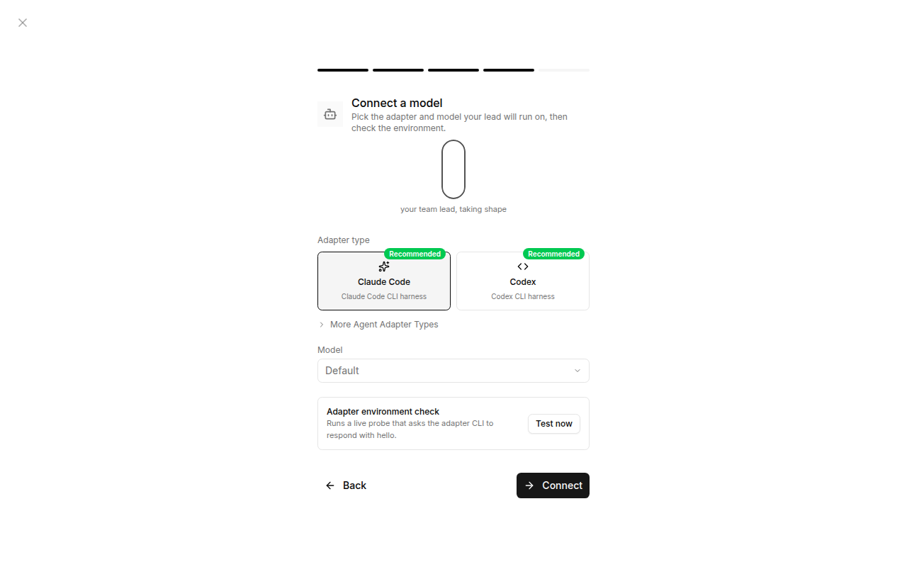
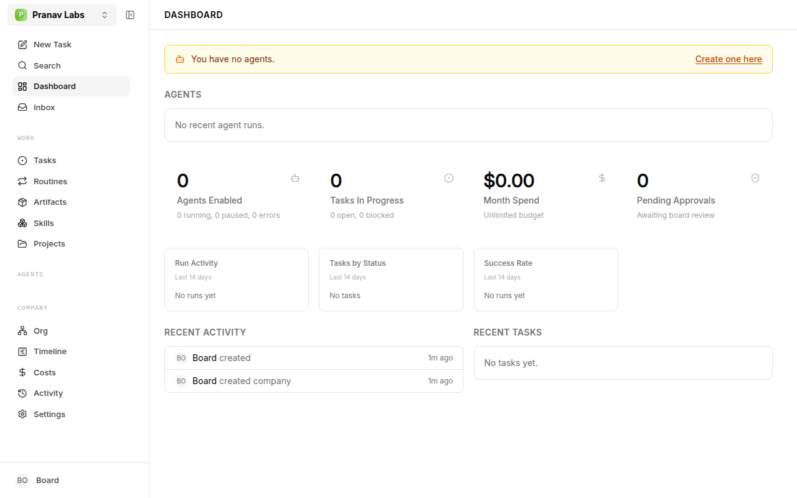

# How to use Paperclip

Paperclip is a manager for AI agents. You are "the Board". You set a
mission, hire AI agents (starting with a CEO), give them budgets, and they
create and work through tasks on their own. Paperclip itself does no AI
work - it launches tools like Claude Code or Codex and tracks what they do.

## The 6 ideas you need

| Idea      | Plain meaning                                                   |
|-----------|-----------------------------------------------------------------|
| Company   | One project with one mission, its own agents, tasks and budget  |
| Agent     | An AI "employee" with a role, a manager, a model, and a budget   |
| CEO       | First agent. Reads the mission, proposes a plan, creates tasks  |
| Task      | A ticket (like Jira) assigned to an agent, with a comment thread |
| Heartbeat | Timer that wakes an agent to check its tasks and do work         |
| Approval  | Things agents must ask you for: strategy, new hires             |

## Step by step

### 1. Start it

```
npx paperclipai onboard --yes    # first time
npx paperclipai run              # after that
```

Open http://127.0.0.1:3100

### 2. Name your company


### 3. Set the mission

Be specific. The CEO plans everything from this sentence.
Bad: "Make money". Good: "Build a Spring Boot REST API for a library
system with JWT auth, tests, and a README, in the repo at ~/work/library".


### 4. Create the first agent (the CEO)

Default name is "Chief of staff" - rename if you like.

### 5. Connect a model



- Adapter: **Claude Code** (needs Claude Code installed) or Codex.
- Model: a strong model for the CEO, a cheaper one for worker agents.
- Add `ANTHROPIC_API_KEY` as an environment variable / secret.
- Click **Test now** - it asks the CLI to say "hello". Must pass before
  you continue.
- Set a **working directory**: the folder the agent is allowed to edit.
  Use a dedicated folder, not your home directory.

### 6. Set budgets BEFORE turning on heartbeats

Costs page and each agent's settings. Agents stop automatically at 100%.
Start small ($5-10/month) while learning. Expect $5-20 just to try it out.

### 7. Watch it work



- **Dashboard**: agents, tasks in progress, spend, pending approvals.
- **Inbox / Approvals**: approve the CEO's strategy and hire requests.
- **Tasks**: the board. You can also create tasks yourself (New Task).
- **Agents -> Runs**: full transcript of what each run did.
- **Costs**: spend per agent. **Activity**: audit log of everything.
- **Org**: the org chart.

### 8. Your daily loop

1. Check Inbox for approvals and blocked tasks.
2. Read new task comments; answer questions agents ask.
3. Review Costs.
4. Pause any agent that is going in circles.

## Tips

- One company per project keeps context and costs separate.
- Give each agent its own working directory so they do not overwrite
  each other.
- Never give an agent a folder with personal files or secrets in it.
- Review agent output like you would a junior developer's PR.
